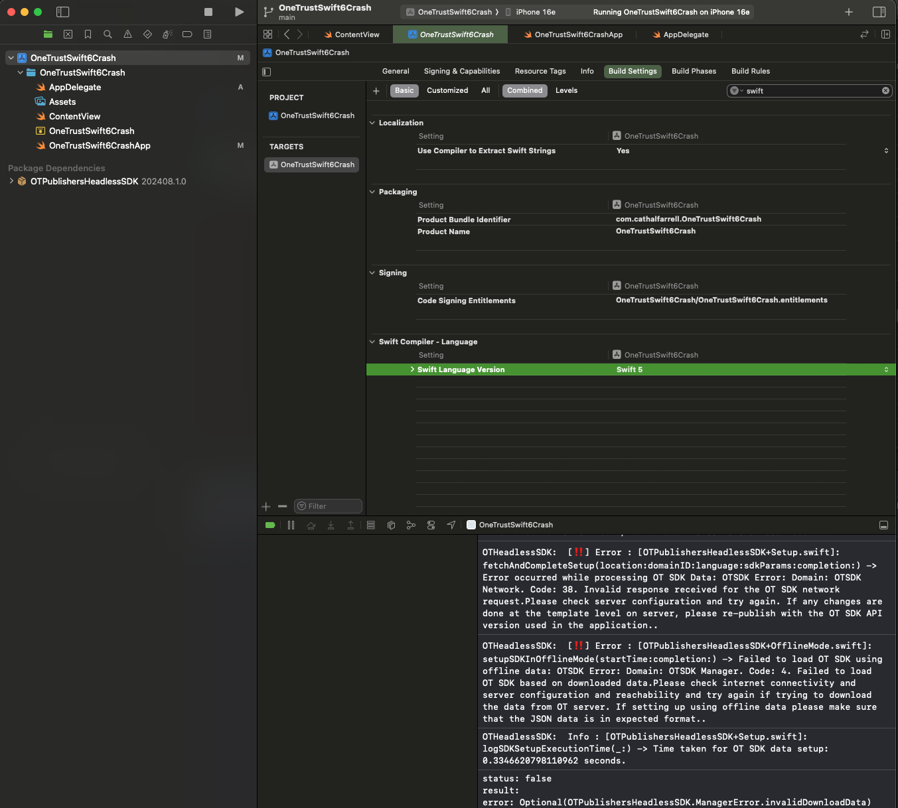
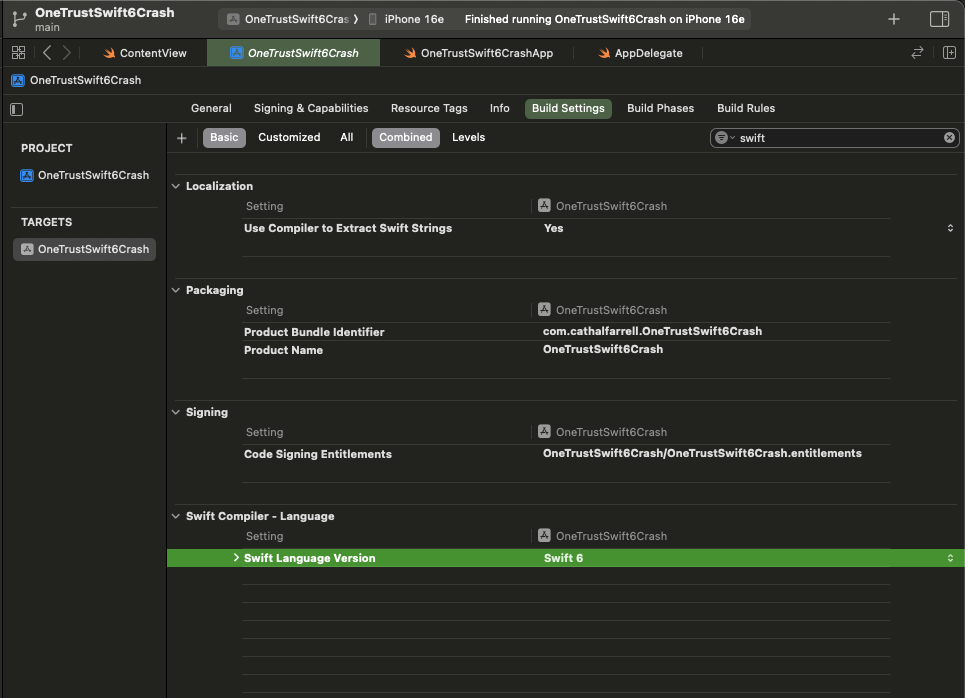
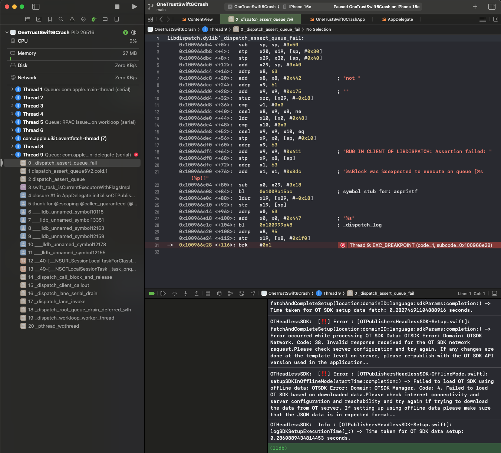

This Repo was created to assist the One Trust SDK team to help me solve this crash.

### Steps:

I configured One Trust SDK 202408.1.0 in a basic project in Xcode 16.3

When the swift version in the target's build settings is Swift 5 the app runs fine:

But after I update the target's build settings to Swift 6:

I get a crash on initialisation of the SDK:

See example project in the repo.

My current project uses SDK version 202408.1.0 but even the latest SDK gives the same crash.
I need to migrate my app to Swift 6 for concurrency, so help in fixing this carsh would be most helpful.
